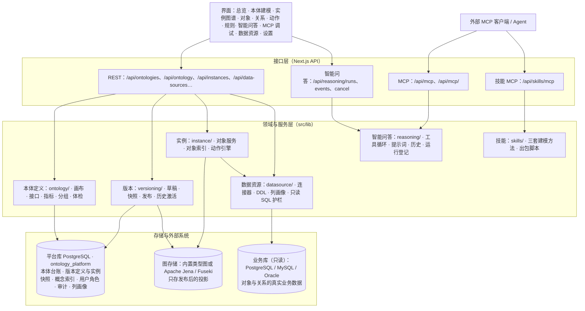

# 第 1 章 · 系统概览与使用地图

## 1.1 系统是什么

本体管理平台是一套面向企业数据与 AI 应用的本体（Ontology）建模、版本管理和能力验证平台。它把“业务世界由哪些对象与关系组成、这些对象的数据从哪里来、对它们可以做什么操作”固化成一份可版本化、可发布、可被模型和外部 Agent 使用的定义。

平台的重点不是提供一个孤立的图数据库，而是提供一条完整链路：

```text
业务定义（对象类型 / 关系类型 / 接口 / 指标）
        ↓
绑定业务数据（数据资源、表/视图、主键与列映射）
        ↓
草稿校验 → 发布为版本快照 → 图存储中的已发布视图
        ↓
实例图谱 / 对象 / 关系 / 动作与规则
        ↓
智能问答 / MCP / 外部 Agent 只读消费
```

可以用三句话概括：

- **本体模型**回答“这个业务世界里有什么”：对象类型、属性、关系类型、接口、指标、概念分组。
- **本体实例**回答“现在实际有哪些对象和关系”：实例图谱、对象页、关系页，以及对象索引与回源读法。
- **动力模型**回答“允许对它做什么”：动作是唯一的业务写入口，规则挂在动作上负责拦截、提示和隐藏。

## 1.2 分层架构



理解这套架构只需要抓住一条主线：

> **平台库是定义和版本的权威存储；图存储是发布后的投影；业务库是对象事实的来源。三者职责不同，不能混着理解。**

## 1.3 核心术语

| 术语 | 一句话解释 | 常见误读 |
| --- | --- | --- |
| 对象类型（Object Type） | 一组对象的定义：属性、主键、展示属性、接口、数据来源 | 不是“一张表”；表只是它的数据落地方式之一 |
| 对象（Object） | 对象类型的一个具体实例，例如“张三”“某条专线” | 不等于图里一个孤立节点；身份通常是“对象类型 + 主键” |
| 关系类型（Link Type） | 两个对象类型之间关系的定义，一条定义、两个端点、双向可用 | 不是“关系实例”；也不需要为正反方向各建一条 |
| 关系（Link） | 两个具体对象之间的一条边 | 关系实例的数据来源可以来自中间表，也可以来自外键 |
| 属性（Property） | 对象类型或关系类型上的一个字段定义，含类型、必填、唯一、枚举、来源列等规则 | 属性可以来自不同数据来源，不一定来自同一张表 |
| 接口（Interface） | 一组属性、关系和动作约束组成的抽象契约；对象类型可以实现多个接口 | 不是父类继承；平台里没有父子继承，抽象机制只有接口 |
| 指标（Metric） | 一条业务口径：作用对象类型、聚合方式、固定过滤、可用维度、单位 | 指标不是查询结果，也不存数 |
| 概念分组 | 对象类型的业务域归类，只影响画布分组、检索与工具呈现 | 不参与图推理，不改写本体定义 |
| 动作（Action） | 定义在对象类型上的一组写操作模板，是业务写入的唯一入口 | 不是任意脚本；参数、编辑步骤和规则都由平台校验 |
| 规则（Rule） | 挂在动作上的 BLOCK / WARN / HIDE 条件与提示 | 规则不是独立写入通道，必须依附动作语义 |
| 数据资源 | 外部业务库的只读连接，例如 Oracle / PostgreSQL / MySQL | 不是本体存储，也不是平台库 |
| 图引擎连接 / 本体存储 | 本体发布后投影到哪个图库：内置类型图或 Jena/Fuseki | 不是业务数据源；删图数据不等于删版本快照 |
| 版本（Version） | 一份不可拆分的完整快照：定义 + 对象节点 + 关系边 + 内容哈希 + 状态 | 不只是“类型定义的历史” |
| 本体包（Bundle） | 单文件 `.ontology.json`，携带结构定义与数据资源坐标，不含实例和凭据 | 不是平台内部版本快照的替代品 |

## 1.4 三条生命周期

### 本体定义的生命周期

```text
新建/导入本体
  → 创建草稿（复制当前发布版或从空白开始）
  → 在可视化画布或各清单里编辑
  → 建模体检（建议）/ 发布校验（门禁）
  → 发布（整图替换）
  → 历史版本激活（有草稿时禁止切换）
```

### 对象数据的生命周期

```text
业务库中的一行数据
  → 对象类型绑定数据来源（主来源 + 可选补充来源）
  → 按主键形成对象身份
  → 对象服务：优先读对象索引，缺失则回源业务库
  → 需要编辑/跑动作时，把业务对象“取进草稿快照”
  → 动作执行成功后写入草稿快照
  → 发布新的本体版本，形成新的已发布视图
```

### 能力验证的生命周期

```text
发布一份可信的本体版本
  → 平台内智能问答使用只读工具查询定义与数据
  → 外部 MCP 客户端用会话或访问令牌接入
  → 工具按全局默认 + 本体覆盖的开关决定模型能看到什么
  → 问答运行、工具调用和关键平台操作进入审计
```

## 1.5 左侧导航地图

| 导航分组 | 页面 | 主要用途 | 进入所需权限 |
| --- | --- | --- | --- |
| — | 总览 | 查看当前本体运行状态、本体列表，新建/导入/打开/导出 | `ontology.read` |
| 本体模型 | 本体建模 | 可视化建模、概念分组、对象类型、关系类型、接口、指标 | `ontology.read` |
| 本体模型 | 本体技能 | 下载三套建模技能，查看技能 MCP 接入 | `ontology.read` |
| 本体实例 | 实例图谱 | 查看对象与关系的实例图，展开邻居，只读查询 | `instance.read` |
| 本体实例 | 对象 | 按对象类型浏览对象，回源/物化取数，编辑属性，运行动作 | `instance.read` |
| 本体实例 | 关系 | 浏览、创建、编辑、删除关系实例 | `instance.read` |
| 动力模型 | 动作 | 定义动作、参数、写操作和规则 | `ontology.read` |
| 动力模型 | 规则 | 按动作查看和管理拦截/提示/隐藏规则 | `ontology.read` |
| 能力验证 | 智能问答 | 与本体 Agent 对话，查看工具轨迹、证据和历史 | `reasoning.use` |
| 能力验证 | MCP 调试 | 试调工具、查看接入地址、管理工具开关与访问令牌 | `reasoning.use` |
| 平台 | 数据资源 | 登记外部关系库，浏览表结构，绑定对象类型 | `datasource.read` |
| 平台 | 设置 | 图引擎配置、审计记录、用户与角色 | 所有登录用户可进；标签各自判权限 |

> 权限在左侧导航上的效果是“没权限就不显示”。但界面隐藏只是体验，服务端每个接口还会独立校验；没权限时返回 **403**。

## 1.6 典型使用场景

### 场景一：从零建一个本体

1. 在“总览”新建本体，选择内置图存储或已登记的 Jena 连接。
2. 进入“本体建模 → 可视化建模”，先落对象类型，再从节点拉出关系类型。
3. 在对象类型里补属性、主键、展示属性、枚举值与接口实现。
4. 如已有外部数据，先在“数据资源”登记连接，再回到对象类型绑定主来源和补充来源。
5. 用“指标”把关键业务口径固化下来。
6. 先跑“建模体检”优化，再“校验”并“发布”。
7. 在“对象/实例图谱”确认数据能读出来，在“智能问答”用自然语言验证。

### 场景二：把已有本体交给外部 Agent

1. 确认本体已发布，且工具开关按需要打开。
2. 进入“MCP 调试 → MCP 接入”，选择平台级或本体级地址。
3. 在“访问令牌”里为本客户端生成一条令牌；不要多个客户端共用一条。
4. 复制对应客户端的配置片段，填入客户端。
5. 让 Agent 先用 `list_ontologies` / `search_schema` 确认概念，再查类型、表结构和数据。

### 场景三：从别人的环境接收一份本体

1. 拿到 `.ontology.json` 本体包或 bkn 知识网络。
2. 在“总览 → 导入”上传；大文件用 `scripts/import-ontology.mjs` 命令行导入。
3. 导入后一定停在草稿，按提示补齐没接上的数据资源绑定。
4. 运行“校验”，处理硬性违规；体检建议可按优先级处理。
5. 发布后，实例数据仍需从数据资源物化或回源读取，包里不会带对象数据。

## 1.7 能力总览与状态

| 能力 | 状态 | 用户入口 | 关键限制 |
| --- | --- | --- | --- |
| 本体建模（可视化 / 清单） | 已实现 | 本体建模 | 无父子继承；抽象机制只有接口 |
| 概念分组 | 已实现 | 本体建模 → 概念分组 | 只影响展示、检索与工具，不参与推理 |
| 接口与实现 | 已实现 | 本体建模 → 接口 | 实现接口必须满足属性、关系、动作约束 |
| 指标 | 已实现 | 本体建模 → 指标 | 只描述口径，不出数 |
| 版本快照 | 已实现 | 本体建模页头 | 存在草稿时不能激活历史版本 |
| 本体包导出/导入 | 已实现 | 总览 / 本体建模 | 只带结构，不带实例与凭据 |
| bkn 知识网络导入 | 已实现 | 总览 → 导入 | 装不下的内容逐条列出，不静默丢弃 |
| 实例图谱 / 对象 / 关系 | 已实现 | 本体实例 | 写操作只作用于草稿 |
| 动作与规则 | 已实现 | 动力模型 | 动作是唯一写入口；执行需要 `instance.write` |
| 数据资源（PG/MySQL/Oracle） | 已实现 | 平台 → 数据资源 | 只读访问；凭据加密保存 |
| 列画像 | 已实现 | `get_table_ddl` / 模型侧 | 只对已绑定表、只采样 1000 行、按天缓存 |
| 对象索引与对象检索 | 已实现 | 对象服务 / API | PostgreSQL 派生索引；当前无 embedding 提供方 |
| 智能问答 | 已实现 | 能力验证 → 智能问答 | 需要配置 LLM；后台运行只存内存，进程重启会丢正在跑的运行 |
| MCP 本体数据服务 | 已实现 | MCP 调试 | 只读；最后只认已发布版本 |
| MCP 技能服务 | 已实现 | 本体技能 | 免令牌；只提供公开技能文档 |
| 查询 DSL（`run_query`） | 暂未开放 | 代码目录 / 本说明书附录 | 编译器与关系查询已具备，工具仍为平台永久关闭 |
| 权限与审计 | 已实现 | 设置 | 13 个权限点；内置角色不可改不可删 |

## 1.8 系统边界

以下内容是明确的边界，不是“还没写文档”：

- **本体定义与实例快照在平台库，图库只存发布后的投影。** 不要直接改图库并指望平台把它当成新版本。
- **智能问答与 MCP 全部只读。** 业务数据写入只能通过动作；动作也作用在草稿快照上，需要发布才进入新版本视图。
- **本体包不带实例数据。** `statistics.objects` 只是导出端的计数，接收端导入后对象数是 0。
- **平台没有父子继承。** 需要表达“多个类型共享一套形状”时用接口。
- **表只能通过对象类型到达。** 智能问答不提供 `list_tables` / `search_columns` 这类直接枚举数据源表的工具。
- **对象索引是派生数据。** 它坏了可以从已发布快照重建，不影响本体版本的正确性。
- **当前没有 embedding 提供方。** PostgreSQL 的向量列和索引可以建，但没有模型生成向量，向量检索暂不可用。

## 1.9 怎么继续读

- 要开始安装或部署：读第 2 章。
- 要理解账号、角色、权限：读第 3 章。
- 要建模：按第 4 → 5 → 8 章顺序读。
- 要让模型查数：读第 9 章，再读第 13 章与查询 DSL 附录。
- 要把平台接给外部 Agent：读第 10 章。
- 要做部署、备份和排障：读第 12、14 章。